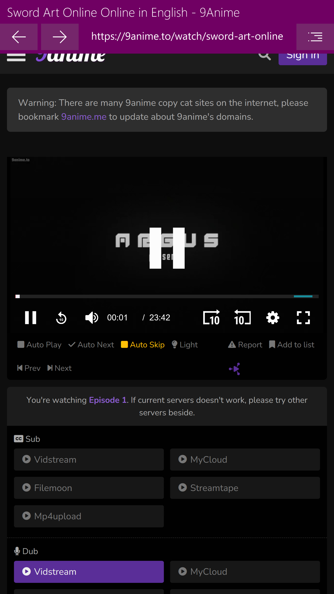

# 9anime PWA for Windows 10 devices
A quick and simple UWP app to access 9anime webpage

Important note: 9Anime has implimented a browser check upon loading their domains, which has broken accessing their web pages on WebView and Windows Mobile's EdgeHTML.. hopefully this will be resolved soon

Features:
- Blocks ads and popups (any any domain that is not 9anime)
- Save and load bookmarks
- Import and Export saved bookmarks from this app
- Accent theme matches NavBar theme

Requirements:
- Windows 10 15063 and above (arm, x86 and x64)

